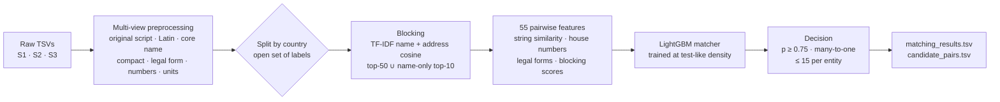

# Amazon Business Entity Resolution

This pipeline matches business records across three noisy sources for **ML Challenge 2026 – Business Entity Resolution**. For every Source 1 business it finds all records in Source 2 and Source 3 that describe the same business. The records come from three countries (US, India, and France, which appears only in the test set), are written in several scripts, and are full of typos.

**Public leaderboard: 0.96 macro F0.5, rank 341 of 9,000+ teams** (final model v3.2). The Kaggle run is [here](https://www.kaggle.com/code/tanweerahmad04/notebook02e3b90c22/notebook).

| | |
|---|---|
| Test entities matched | 1,732,544 Source 1 businesses against 9.97M Source 2/3 records |
| Candidate pairs scored | 92.1M, after blocking, from ~2.3×10¹³ possible pairs |
| Predicted links | 5.34M (3.08 per business; 7.0% left unmatched) |
| Holdout (20k unseen businesses) | F0.5 **0.954** · precision 0.980 · recall 0.898 |
| Runtime | ~3 h on a 4-CPU Kaggle machine, no GPU |

---

## The problem

- **Input.** Three tab-separated files with `entity_id`, `business_name`, `business_address` and `country`.
  - Train: 2.2M Source 1 records against 10.3M Source 2/3 records, with ground truth.
  - Test: 1.73M Source 1 records against 9.97M Source 2/3 records.
- **Task.** For each Source 1 entity, output every matching Source 2/3 id. There can be none, one, or many (at most 11 in training).
- **Metric.** Macro F0.5 per Source 1 entity, so precision counts twice as much as recall.
  - An entity with no true match (a *singleton*) scores 1 only if the prediction is empty.
- **What makes it hard:**
  - Names appear in Devanagari as well as Latin script (`राम मार्केटिंग प्राइवेट लिमिटेड` ↔ `Ram Marketing Pvt Ltd`).
  - Typos (`COIMATORE`), junk prefixes (`-- `, `<< `), domains used as names, and many forms of legal suffix.
  - Addresses are reordered, abbreviated or missing, and house numbers have dropped digits.
  - The test data adds **France**, a country never seen in training, making up 15% of the test set.
  - The test pool is **23% denser** than the training pool: 5.75 vs 4.68 Source 2/3 records per Source 1 record, so there are more distractors.

Findings from data exploration that shaped the design (details in [`docs/running_log.md`](docs/running_log.md)):
- Every match is **within one country**, with 0 cross-country links in 153k sampled pairs, so country is a safe hard partition.
- Matching is strictly **many-to-one**: each Source 2/3 record belongs to at most one Source 1 entity.
- 5.58% of Source 1 entities are singletons; the rest have 3.46 matches on average.
- A shared address token covers 95.6% of true pairs and a shared name token 85.8%. Postal codes cover only 5%, so they are useless for blocking.

## Pipeline



1. **Preprocessing.** Raw text is never overwritten; each field gets several derived views:
   - original script (NFC);
   - Latin transliteration and accent folding;
   - *core* name without legal suffixes, plus a *compact* (spaceless) name;
   - legal form, aliases (`d/b/a`), initials;
   - house number, postal code, unit, number of address components;
   - flags for missing addresses and mixed scripts.

   Four optional rules were each tested against validation F0.5 and none was adopted, because none improved it by more than noise (table in `results/switch_gate.csv`): encoding repair, placeholder removal, state expansion, street abbreviations. A fifth candidate, a different Devanagari transliteration scheme, also stayed off.
2. **Blocking, per country.**
   - TF-IDF vectors for name and address, scored by cosine similarity (normalised on the candidate side) and blended 50/50.
   - Keep the top 50 plus a name-only top 10. The name-only channel rescues records with empty or garbled addresses.
   - Tokens that appear in more than 0.5% of a country's pool are not used as blocking keys.
   - Implemented with `sparse_dot_topn`. On the full pool this keeps 94% of true pairs with about 53 candidates per entity.
3. **Features.** 55 per candidate pair:
   - rapidfuzz scores (ratio, token set/sort, partial, Jaro–Winkler) on several name and address views;
   - legal-form agreement or conflict; alias and initials matches;
   - number, postal and unit agreement;
   - script flags and token counts;
   - **house-number features**: equal, absolute and relative difference, digit edit distance, truncation;
   - blocking score, rank and gaps to the best candidate.
4. **Matcher.**
   - LightGBM (binary, 127 leaves, learning rate 0.08, up to 1,000 rounds with early stopping).
   - Trained on 10.6M candidate pairs from 200k training entities.
   - **Density matching:** training entities retrieve candidates from a pool with extra distractor records added, sampled from the test Source 2/3 records. Their ids are disjoint from training, so they are guaranteed non-matches. This brings training density up to the test density: +1.01M records for India, +1.43M for the US.
5. **Decision.**
   - Accept pairs with probability ≥ 0.75. The threshold is tuned for F0.5 on validation and checked on an untouched holdout.
   - Each Source 2/3 record goes to at most one Source 1 entity: the one with the highest probability.
   - At most 15 matches per entity.
   - Country is never a model feature, so France and any unseen label are handled the same way.

## Results

**Validation.** All on 20k Source 1 entities. The holdout was never used for any choice (`results/validation_metrics.csv`).

| Evaluation | F0.5 | India | US | Precision | Recall | Singleton accuracy |
|---|--:|--:|--:|--:|--:|--:|
| Mini-world (small pool) | 0.976 | 0.966 | 0.983 | 0.988 | 0.951 | 0.970 |
| Full pool, test-like density: validation | 0.953 | 0.935 | 0.964 | 0.978 | 0.898 | 0.943 |
| Full pool, test-like density: **holdout** | **0.954** | 0.933 | 0.968 | 0.980 | 0.898 | 0.957 |

- The holdout F0.5 curve is flat between 0.70 and 0.80 (0.954 → 0.953), so the threshold choice is robust (`results/holdout_threshold_curve.csv`).
- Blocking on the full pool keeps 94.0% of true pairs. A perfect matcher on these candidates would score 0.977, so blocking costs about 0.023 of F0.5 and the matcher about 0.025.
- Leave-one-country-out, a proxy for unseen France: training on the US and scoring India gives 0.926 instead of 0.966; India to US gives 0.969 instead of 0.983 (`results/leave_one_country_out.csv`).
- The most important features by gain are `rank` (56%), `num_tset`, `n_compact_ratio`, `blk`, `a_tset`, `n_latin_ratio` and `n_core_partial`, plus the house-number features `hn_absdiff`, `hn_eq` and `hn_trunc` (`results/feature_importance_gain.csv`).

**Test set** (`results/test_per_country.csv`):

| Country | Test entities | Source 2/3 pool | Candidate pairs | Matches per entity | Minutes |
|---|--:|--:|--:|--:|--:|
| France | 259,452 | 1,434,993 | 14.0M | 2.90 | 15 |
| India | 809,986 | 4,717,565 | 44.0M | 3.04 | 72 |
| US | 663,106 | 3,817,031 | 34.1M | 3.21 | 50 |

The official validator passed.

## Version history

The notebooks are in [`experiments/`](experiments/README.md).

| Version | Change | Public LB |
|---|---|--:|
| v2 | Multi-view preprocessing, TF-IDF blocking, 49 features, LightGBM | 0.933 |
| v3 | + density matching, house-number features, 4 name/address frequency features, 200k training entities | 0.929 |
| v3.1 | Country treated as an open set of labels (no hard-coded US/India); same predictions as v3 | — |
| **v3.2** | **Frequency features removed** (55 features) | **0.96** |

**Why v3 dropped and v3.2 recovered.** The frequency features counted how common a name or address is *per 100k records* of the population being scored. The test population is 2–5× smaller than the training population (US: 663k vs 1.32M entities), so on the test set every name looked much more common than in training. The holdout could not detect this because it comes from the training population. Removing those features kept the gains from density matching and the house-number features.

## Repository layout

```
notebooks/er_pipeline_v3_2.ipynb   final pipeline (Colab or Kaggle), the run that scored 0.96
src/er_pipeline_v3_2.py            plain-Python export of the notebook for reading on GitHub
models/matcher_lgb.txt             trained LightGBM matcher (55 features; see models/README.md)
results/                           results_v3_2.json (full run log) + CSV tables used above
experiments/                       v2, v3 (+ its results.json and a re-threshold cell), v3.1
docs/running_log.md                analysis log: exploration → design decisions → every run and its interpretation
docs/EDA_Report_Business_Entity_Resolution.docx
```

## How to run

1. Get the challenge data from the organisers. **The competition data is not included here.**
2. Build the *mini-world* folder (`train/` and `val/` Source 1, a shared Source 2/3 pool, ground truth, and `splits_v1.tsv`). This is the fast-iteration and validation split described in `docs/running_log.md` (Part 3).
3. On Kaggle:
   - attach the challenge folder and the mini-world as Datasets;
   - turn Internet on (for `pip install`);
   - use **Save & Run All**.

   On Colab, paste the two Drive folder links into the config cell instead.
4. Phase A (mini-world) takes about 7 minutes. Phase B trains the final model (about 33 minutes), then scores the test set per country (about 2.4 hours) and writes `matching_results.tsv`, `candidate_pairs.tsv`, `results.json` and one file per extra threshold.

Requirements: Python 3.10+, `pandas`, `pyarrow`, `numpy`, `scipy`, `scikit-learn`, `lightgbm`, `rapidfuzz`, `sparse_dot_topn`, `unidecode`, `indic-transliteration`, `ftfy` (see `requirements.txt`). CPU only.

## Limitations and next steps

- **Recall is the weaker side** (0.90 against 0.98 precision). The main misses are:
  - true matches whose address is empty and whose name differs (a DBA name, or a translation into another script);
  - house numbers with dropped digits that the model still rejects.
- **Cross-script names** (Devanagari ↔ Latin) remain the largest known gap. A learned transliteration model or a small multilingual character model is the next lever.
- France has no labels. Its behaviour is estimated only through leave-one-country-out; its prediction profile (2.90 matches per entity) is close to US (3.21) and India (3.04).

## License

MIT for the code in this repository (see `LICENSE`). The challenge data belongs to the competition organisers and is not redistributed.
